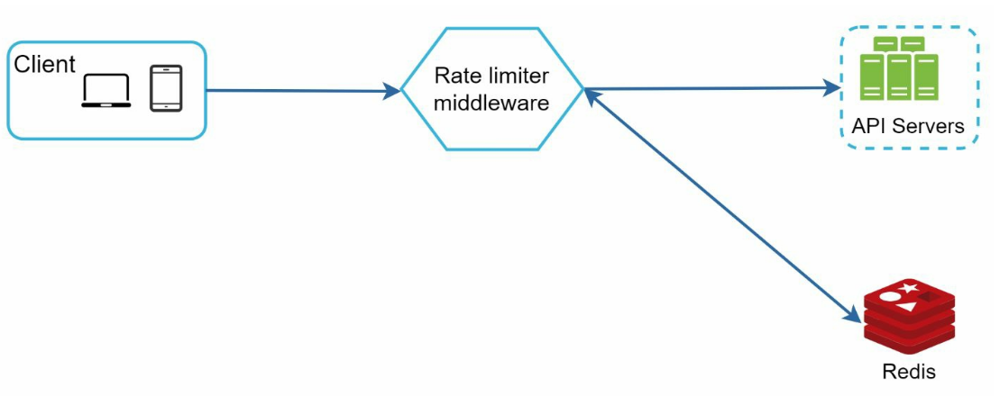
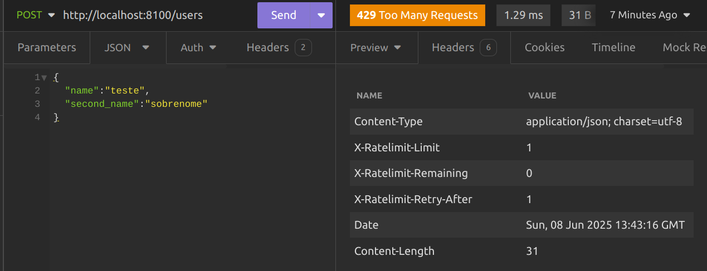

# Rate Limiter

Nesse repositório você encontrará como implementar alguns exemplos de rate limiter para a sua API, entenderá algumas nuances que envolvem a sua aplicação e entenderá na prática como eles funcionam. Os exemplos aqui presentes podem ser acessados através do livro System Design Interview - An insider's guide.

# Design


<br><br/>

# O que é um Rate Limiter

O que é um Rate Limiter?
Um Rate Limiter (limitador de taxa) é um mecanismo usado para controlar a frequência com que um cliente pode acessar um recurso ou serviço dentro de um determinado intervalo de tempo.

Ele serve para:

- Proteger serviços contra abuso ou ataques de negação de serviço (DoS);

- Evitar sobrecarga em APIs ou servidores;

- Aplicar limites por usuário, IP, token de API, etc.;

- Manter qualidade de serviço para todos os usuários.

# 📊 Principais algoritmos de rate limiting

1. 🪣 Fixed Window (Janela Fixa)

   - Divide o tempo em blocos (ex: a cada minuto).

   - Conta quantas requisições foram feitas naquela janela.

   - Simples, mas pode causar picos de requisições nas bordas das janelas.

2. 🧮 Sliding Window (Janela Deslizante)

   - Janela de tempo é baseada na hora atual menos X segundos.

   - Mais justo que a janela fixa, mas mais complexo de implementar.

3. 💧 Leaky Bucket (Balde com vazamento)

   - Imita um balde que vaza a uma taxa constante.

   - Requisições entram no balde, e se ele encher, são rejeitadas.

   - Suaviza a taxa de requisições.

4. 🛢️ Token Bucket

   - Um balde acumula "tokens" ao longo do tempo.

   - Cada requisição consome um token.

   - Se não houver tokens, a requisição é negada.

   - Permite pequenos "estouros" de requisições, ideal para sistemas que precisam de burst tolerance.

## Tolerância a Burst

A tolerância a burst (ou burst tolerance) se refere à capacidade de um algoritmo de rate limiting permitir picos curtos e intensos de requisições em um curto espaço de tempo, sem violar o limite total.

### 🧠 Exemplificando:

    Suponha:
        - Limite: 10 requisições por minuto

        Dois usuários enviam requisições:

            Caso com tolerância a burst (ex: Token Bucket):
                -   Um usuário envia 10 requisições de uma vez → 💚 Aceito (bucket cheio).
                -   Depois, ele precisa esperar o refill dos tokens.

            Caso sem tolerância a burst (ex: Leaking Bucket):
                -   O sistema só permite, por exemplo, 1 requisição a cada 6 segundos.
                -   Mesmo que ele tenha feito zero requisições antes, se tentar 10 de uma vez → ❌ Só a 1ª entra, as outras são rejeitadas.

## 📊 Comparação rápida - Algoritmo Tolerância a Burst Comportamento:

    - Token Bucket - Alta - Permite picos rápidos até encher o balde
    - Leaking Bucket - Baixa - Fluxo constante, limita picos abruptos
    - Fixed Window - Média - Depende do momento em que o "clock" reinicia
    - Sliding Window - Média/Alta - Mais equilibrado entre burst e suavização

### ✅ Quando usar alta tolerância a burst? - APIs públicas que devem ser rápidas com picos pequenos.

    - Sistemas tolerantes a carga variável.
    - Usuários legítimos que fazem ações em lote (ex: dashboards, scripts).

### ❌ Quando evitar? - Quando o sistema backend é sensível a carga repentina.

    - Quando você precisa garantir um ritmo constante e previsível (ex: filas de mensagens, robôs de consumo de dados).

## Iniciando o projeto

📌 Configurando o Backend:

- Na pasta do backend crie um arquivo .env com as credenciais semelhantes ao do arquivo .env.example.

📌 Construindo a imagem dos nossos serviços.

- `docker-compose up -d --build`

📌 Verificando se os serviços estão rodando.

- `docker ps`

## 🎯 Realizando testes na nossa aplicação

URL API: http://localhost:8100

Rotas:

- POST (/users)

```json
Body da requisição
{
  "name": "teste",
  "second_name": "sobrenome"
}
```

- GET (/users)

```json
Response da requisição
{
	"source": "database",
	"users": [
		{
			"id": 1,
			"name": "teste",
			"second_name": "sobrenome",
			"created_at": "2025-03-29T16:34:19Z",
			"updated_at": "2025-03-29T16:34:19Z"
		}]
}
```

## Alternando os middlewares de Reate Limiter

Em cmd/main.go altere nas rotas entre os tipos de rate limiter que quer aplicar para testes. Abaixo seguem os exemplos.

- router.POST("/users", rateLimiter.FixedWindowHandler(1\*time.Second, 1.0), userController.CreateUser)
- router.POST("/users", rateLimiter.TokenBucketHandler(5, 1.0), userController.CreateUser)
- router.POST("/users", rateLimiter.LeakingBucketHandler(5, 1.0), userController.CreateUser)


